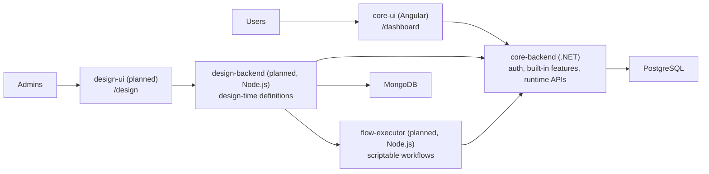

# Eternity

## Expected product vision

Eternity is a privately deployed platform for one organization, team, or community. Each group runs its own instance, invites its own users, and shapes the system around its own processes instead of joining a shared public product.

The target product combines two layers in one place:

- ready-made core features for everyday work, such as authentication, sessions, calls, chat, feed, calendar, and org structure
- design tools that let admins create custom sections, pages, entities, process flows, and AI-assisted automations for their own instance
- one runtime where built-in features and designed features live together for the same users and the same data

The goal is to let a business, team, or private group start with useful built-in collaboration features and then extend the same system with design tools that match how they actually operate.

## Architecture

### Current structure

The repo currently uses `frontend/` and `backend/` at the root. These will be migrated into the target structure below when the first new service is introduced.

- `backend/` (`core-backend`) -- .NET 10: auth, built-in features, real-time coordination, runtime APIs
- `frontend/` (`core-ui`) -- Angular 21: main user experience, runtime-rendered pages
- PostgreSQL database
- SignalR and PeerJS for real-time communication

### Target structure

```
eternity/
├── apps/
│   ├── core-backend/        # .NET 10 -- auth, built-in features, runtime APIs
│   ├── core-ui/             # Angular 21 -- user experience, runtime-rendered pages
│   ├── design-backend/      # Node.js -- design-time definitions, custom pages/entities/flows
│   ├── design-ui/           # Visual builder for admins (/design)
│   └── flow-executor/       # Node.js -- scriptable workflow execution
├── packages/
│   ├── shared/              # Shared types, utils, contracts between Node.js services
│   └── ui-kit/              # Shared UI components between Angular apps
├── docker-compose.yml
├── scripts/
├── .agents/
├── AGENTS.md
└── README.md
```

- `apps/` contains deployable units, each with its own build, dependencies, and AGENTS.md.
- `packages/` contains shared libraries consumed by apps. Added when the second Node.js service needs shared code, not preemptively.
- `packages/ui-kit/` is relevant only if `design-ui` is also Angular.

### Service responsibilities



### Planned expansion

- Core-backend remains the single auth system and runtime host for both built-in and designed functionality.
- Design-backend manages design-time definitions for custom pages, entities, flows, and agents. Uses MongoDB for storing JSON schemas, page definitions, flow configurations, and other design-time artifacts.
- Design-ui is the visual builder for admins.
- Flow-executor runs scriptable workflows while using core-backend runtime APIs.
- Designed UI is stored as parsable JSON so core-ui can render it at runtime.
- Built-in and designed data converge behind the same core runtime entity layer over time.

## Built-in features already implemented

- authentication with cookie-based JWT sessions and persisted session records
- public registration requests with admin approval or rejection
- admin management for registration requests and user sessions
- session visibility and controls for online, active, and inactive sessions, including terminate and ping actions
- audio and video calls with call history, incoming call handling
- authenticated application shell with a profile page and role-aware frontend/backend boundaries

Near-term direction:

- expand the built-in collaboration surface from the current core
- introduce the separate design-time services
- start rendering designed pages, flows, and runtime-managed entities inside the core experience

## AI agent setup

This repo is configured for AI coding agents. The guidance lives in three layers:

- **`AGENTS.md`** (root, `frontend/`, `backend/`) -- always-on rules, git conventions. Deeper files override the root where they conflict.
- **`.agents/skills/`** -- task-specific playbooks loaded on demand. Available skills: `angular-frontend`, `frontend-linting`, `backend-development`, `backend-formatting`, `ui-quality`, `debugging`, `issue-workflow`.
- **Skills are loaded via the `skill` tool** before non-trivial work. Load the smallest relevant set (1-2 skills). `AGENTS.md` rules always take precedence over skills.

To start working on a GitHub issue, reference it by number (e.g. "start working on issue #42") and the `issue-workflow` skill handles branching, implementation, and PR creation.
