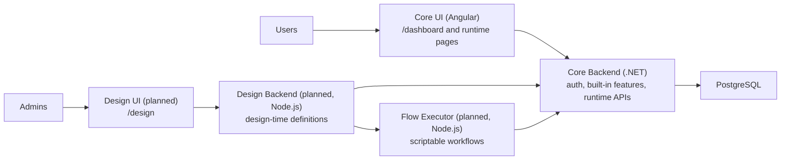

# Eternity

## Expected product vision

Eternity is a privately deployed platform for one organization, team, or community. Each group runs its own instance, invites its own users, and shapes the system around its own processes instead of joining a shared public product.

The target product combines two layers in one place:

- ready-made core features for everyday work, such as authentication, sessions, calls, chat, feed, calendar, and org structure
- design tools that let admins create custom sections, pages, entities, process flows, and AI-assisted automations for their own instance
- one runtime where built-in features and designed features live together for the same users and the same data

The goal is to let a business, team, or private group start with useful built-in collaboration features and then extend the same system with design tools that match how they actually operate.

## Architecture

Current runtime foundation:

- core backend: .NET 10 application for auth, built-in features, real-time coordination, and runtime APIs
- core frontend: Angular 21 application for the main user-facing experience
- database: PostgreSQL
- live communication: SignalR and PeerJS for the current calling flow

Planned expansion:

- the core service remains the single auth system and the runtime host for both built-in and designed functionality
- a design backend is planned for managing design-time definitions for custom pages, entities, flows, and agents
- a design frontend is planned as the visual builder for admins
- a separate Node.js flow executor is planned for scriptable workflow execution while still using the core runtime APIs
- designed UI is expected to be stored as parsable JSON so the core UI can render it at runtime
- built-in and designed data are expected to converge behind the same core runtime entity layer over time

Target public routing:

- `/dashboard/...` for the core user experience and runtime-rendered pages
- `/design/...` for the design system used by admins

## Built-in features already implemented

- authentication with cookie-based JWT sessions and persisted session records
- public registration requests with admin approval or rejection
- admin management for registration requests and user sessions
- session visibility and controls for online, active, and inactive sessions, including terminate and ping actions
- audio and video calls with call history, incoming call handling
- authenticated application shell with a profile page and role-aware frontend/backend boundaries

Near-term direction:

- expand the built-in collaboration surface from the current core
- introduce the separate design-time services
- start rendering designed pages, flows, and runtime-managed entities inside the core experience
